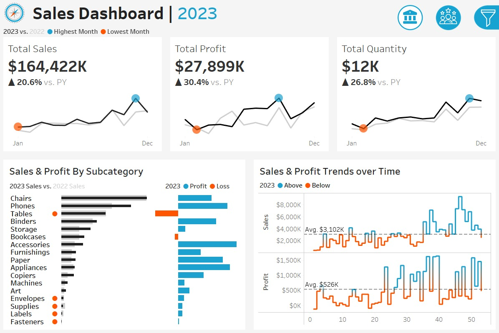
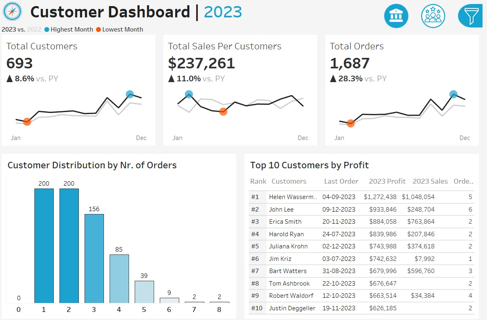

# 📊 Sales and Customer Reports Dashboard

## Overview

This Tableau project presents interactive dashboards that provide detailed insights into **sales performance** and **customer behavior**. The goal is to support business stakeholders in making data-driven decisions by offering a comprehensive view of:

* Sales trends and performance
* Customer segmentation and demographics
* Purchase behavior and patterns
* Regional and product-based analysis

---

## 🚀 Project Objectives

* Track key sales metrics (e.g., revenue, profit, quantity sold)
* Analyze customer demographics and buying behavior
* Monitor performance by product category, region, and time
* Enable interactive filtering for ad hoc analysis

---

## 📷 Screenshots

---

## 📌 Key Dashboards

### 1. **Sales Overview Dashboard**

* Total Sales, Profit, Quantity Sold
* Year-over-Year growth
* Regional and product breakdowns
* Trend analysis with filters by date, product, and region

### 2. **Customer Insights Dashboard**

* Customer segmentation by age, location, and purchase frequency
* Lifetime value analysis
* Churn indicators and new vs. returning customers
* Interactive filters for deeper drill-down

---

## 📊 Data Sources

| Source File         | Description                                             |
| ------------------- | ------------------------------------------------------- |
| `Orders.csv`        | Includes order details and sales metrics                |
| `customers.csv`     | Contains customer demographics and purchase history     |
| `products.csv`      | Contains products info                                  |

---

## 🛠️ How to Use

1. Open Tableau Desktop or Tableau Public.
2. Load the `.twbx` packaged workbook files from the `Tableau/` directory.
3. Interact with the dashboards by using filters and parameters to explore different views.
4. Export visuals or data as needed for reports and presentations.

---

## 📌 Requirements

* Tableau Desktop 2021.1 or later (or Tableau Public)
* Basic understanding of Tableau navigation and filtering
* Data files should be placed in the correct `Data/` directory

---

## 📞 Contact

For questions or suggestions, please contact:

* **Name:** Shubham Singh
* **Email:** [iatco5h@gmail.com](mailto:iatco5h@gmail.com)

---

## ✅ License

This project is for testing analytical use. Redistribution of the data or dashboards requires NO prior approval.

---
